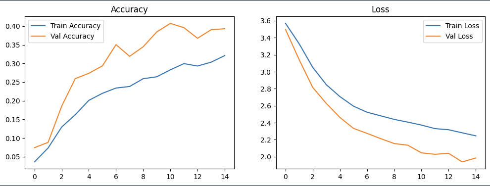
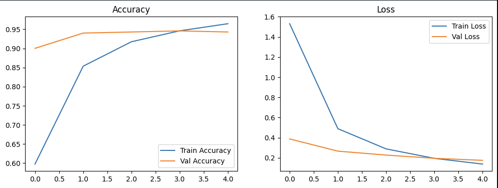

# 🍎🥕 Image Recognition – Fruits & Vegetables Classification

## 📌 Project Overview

This project implements an image classification system to recognize **36 types of fruits and vegetables** using Deep Learning.

Two different approaches are explored and compared:

1. **Custom Convolutional Neural Network (CNN)** built from scratch
2. **Transfer Learning using MobileNetV2 (Pre-trained Model)**

The main objective of this project is to understand the **complete image recognition pipeline**, from dataset preparation to model evaluation and comparison.
This project is intended for **learning purposes and professional portfolio showcase**.

---

## 🗂️ Project Structure

```bash
IMAGE-RECOGNITION/
│
├── public/                         # Images for Documentations
├── datasets/                       # Dataset (train / validation / test)
├── img/                            # Images for testing from user
│
├── image_recognition_custom.ipynb  # Custom CNN implementation
├── image_recognition.ipynb         # Transfer Learning (MobileNetV2)
├── kaggle.py                       # Dataset download script
├── requirements.txt                # Project dependencies
└── README.md                       # Project documentation
```

---

## 📊 Dataset Information

* **Dataset Name**: Fruits and Vegetables Image Recognition Dataset
* **Number of Classes**: 36
* **Image Type**: RGB Images
* **Dataset Split**:

  * `train/`
  * `validation/`
  * `test/`

Each class is stored in its own folder (e.g. `apple`, `banana`, `carrot`, etc.), making it fully compatible with Keras image loaders.

---

## ⬇️ Dataset Download

The dataset is downloaded using the **Kaggle API**.

### Step 1: Install dependencies

```bash
pip install -r requirements.txt
```

### Step 2: Configure Kaggle API

Place your `kaggle.json` file in:

* `~/.kaggle/` (Linux / macOS)
* `C:\Users\<username>\.kaggle\` (Windows)

### Step 3: Download dataset

```bash
python kaggle.py
```

The dataset will be downloaded and extracted into the `datasets/` directory.

---

## 🧠 Model Implementations

### 1️⃣ Custom CNN Model

**File**: `image_recognition_custom.ipynb`

This notebook contains a **custom-built CNN** designed to understand how convolutional neural networks learn visual features from scratch.

**Architecture Highlights:**

* Convolutional layers
* MaxPooling layers
* Global Average Pooling
* Fully Connected (Dense) layers

**Purpose:**

* Learn CNN fundamentals
* Understand feature extraction
* Establish a baseline performance

---

### 2️⃣ Transfer Learning – MobileNetV2

**File**: `image_recognition.ipynb`

This notebook uses **MobileNetV2 pre-trained on ImageNet** as a feature extractor.

**Key Concepts Applied:**

* Pre-trained backbone (MobileNetV2)
* Frozen base model to preserve learned features
* Custom classifier head
* Efficient and stable training

**Why MobileNetV2?**

* Lightweight architecture
* Fast training
* High accuracy
* Suitable for limited computational resources

---

## 📈 Results and Model Comparison

### Quantitative Results

| Model Type                | Test Accuracy |

| ------------------------- | ------------- |

| Custom CNN                | ~39%          |

| MobileNetV2 (Pre-trained) | ~95%          |

### Visual Results

The following figures show the final evaluation results for both approaches:

#### 🔹 Custom CNN Result



#### 🔹 Transfer Learning (MobileNetV2) Result



### Observations

* The custom CNN provides a solid learning baseline but is limited by dataset size and training from scratch.
* Transfer learning significantly improves performance by leveraging prior knowledge from large-scale datasets.
* Freezing the pre-trained backbone ensures better generalization and prevents overfitting.

---------------------------|---------------|
| Custom CNN                | ~39%          |
| MobileNetV2 (Pre-trained) | ~95%          |

### Observations:

* The custom CNN provides a solid learning baseline but is limited by dataset size.
* Transfer learning significantly improves performance by leveraging prior knowledge from large-scale datasets.
* Freezing the pre-trained backbone ensures better generalization and prevents overfitting.

---

## 🔍 Key Learnings

* Training CNNs from scratch requires large datasets to achieve high accuracy.
* Transfer learning is the industry standard for image classification tasks.
* Freezing pre-trained models prevents catastrophic forgetting.
* Validation and test sets are critical for honest model evaluation.
* High accuracy is meaningful when train, validation, and test results are consistent.

---

## 🛠️ Technologies Used

* Python 3.11
* TensorFlow / Keras
* NumPy
* Matplotlib
* Kaggle API
* Jupyter Notebook

---

## 🚀 Future Improvements

* Fine-tuning selected layers of the pre-trained model
* Confusion matrix and error analysis
* Model explainability using Grad-CAM
* Deployment using Streamlit or FastAPI
* Testing with real-world images

---

## 👤 Author

**Dzacky Ahmad**
Informatics Engineering Student
Interested in Machine Learning, Computer Vision, and AI Applications

---

## 📎 Notes

This project is intended for **educational and portfolio purposes**.
All experiments and results are reproducible using the provided notebooks.
